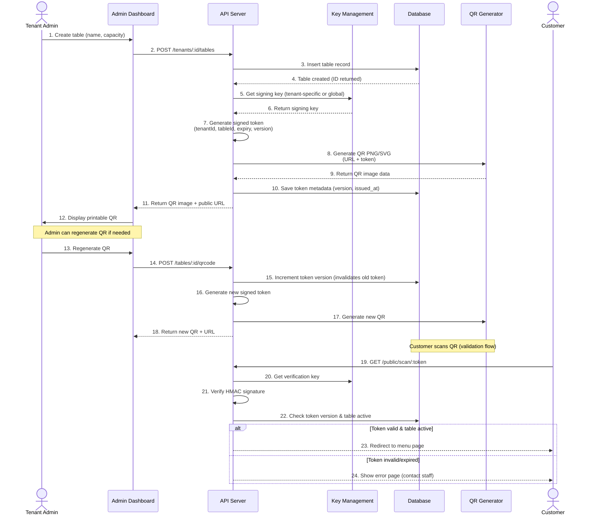

# QR Code Generation & Validation Flow

This diagram shows how QR codes are generated, signed, and validated.



## Token structure (JWT-like, HMAC-signed)
```json
{
  "t": "tenant_uuid",
  "tb": "table_uuid",
  "iat": 1698710400,
  "exp": 1730246400,
  "v": 1
}
```
- **t:** Tenant ID
- **tb:** Table ID
- **iat:** Issued at (Unix timestamp)
- **exp:** Expiry (Unix timestamp, e.g., 1 year)
- **v:** Token version (increments on regenerate; used for revocation)

## Security notes
- Signed with HMAC-SHA256 using per-tenant or platform secret.
- Token version in DB enables instant revocation without blacklist.
- Public URL pattern: `https://unifiedordering.app/s/:tenantSlug/:token`

## Related docs
- User Story: FR-3-001 (06-USER_STORIES.md)
- SRS: FR-4 QR Code Management (02-SRS.md)
- ADR: 0001-auth-strategy.md
