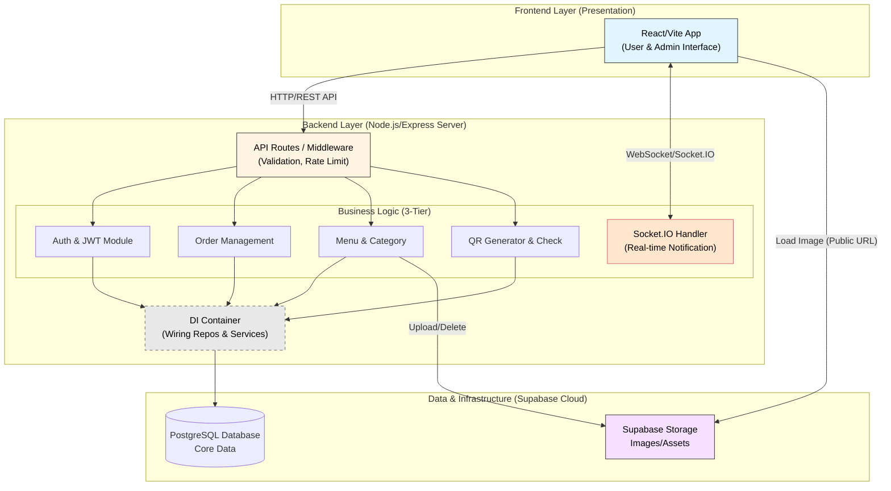

# System Architecture Overview

High-level architecture for the Unified Restaurant Ordering Platform multi-tenant restaurant platform.

## Architecture principles
1. **Multi-tenancy:** Tenant isolation at database row-level (tenant_id foreign key) or schema-level (future scaling option).
2. **Microservices (modular monolith initially):** Services are logically separated; can extract to separate deployments later.
3. **API-first:** All client apps consume REST APIs; WebSocket for real-time updates.
4. **Stateless services:** Auth via JWT; session state in Redis for fast invalidation.
5. **Event-driven notifications:** Order state changes trigger events to notification service (pub/sub or message queue in future).

## Technology stack (MVP)
- **Frontend:** Next.js 14 (App Router), React, TailwindCSS
- **Backend:** NestJS (Node.js), TypeScript
- **Database:** PostgreSQL 15+ with row-level security (RLS)
- **Cache:** Redis 7+
- **Storage:** AWS S3 or compatible (images, QR codes)
- **Payments:** Stripe (hosted checkout initially)
- **Real-time:** Socket.IO or native WebSocket
- **Hosting:** AWS (ECS/Fargate or Lambda for serverless option)
- **CI/CD:** GitHub Actions

## Data flow examples
- **Customer places order:** CustApp → Gateway → OrderSvc → DB (save order) → NotifSvc (notify staff via WebSocket) → StaffApp
- **Admin updates menu:** AdminApp → Gateway → MenuSvc → DB (update items) → Cache (invalidate tenant menu) → publish event
- **QR scan:** Customer scans QR → Gateway → QRSvc (validate token) → DB (check table) → redirect to CustApp with session

## Security layers
- **HTTPS everywhere:** TLS 1.3 at CDN/Gateway
- **JWT auth:** Short-lived access tokens (15 min); refresh tokens (7 days)
- **HMAC-signed QR tokens:** Prevents tampering; versioned for revocation
- **Rate limiting:** Per tenant/IP at Gateway layer (Redis-backed)
- **Tenant isolation:** All queries scoped by tenant_id; RLS policies enforce isolation
- **Secrets management:** AWS Secrets Manager or Vault for API keys

## Scalability & performance targets
- **Throughput:** Support 1000 concurrent customers per tenant (orders/sec TBD)
- **Latency:** API P95 < 200ms; menu load < 1s; order creation < 500ms
- **Availability:** 99.9% uptime (multi-AZ deployment)
- **Auto-scaling:** Horizontal scaling for API services based on CPU/memory

## Future enhancements
- **Message queue:** Add SQS/RabbitMQ for async order processing and event sourcing
- **CDN for dynamic content:** Cache tenant menus at edge (invalidate on publish)
- **GraphQL gateway:** Optional GraphQL layer for flexible client queries
- **Serverless functions:** Move lightweight endpoints (QR validation) to Lambda for cost optimization

## Related docs
- ADR: 0001-auth-strategy.md (multi-tenant auth)
- ER Diagram: docs/03-architecture/ER_DIAGRAM.md
- Deployment: docs/05-infra/DEPLOYMENT_RUNBOOK.md
- API Spec: docs/02-api/openapi.yaml
