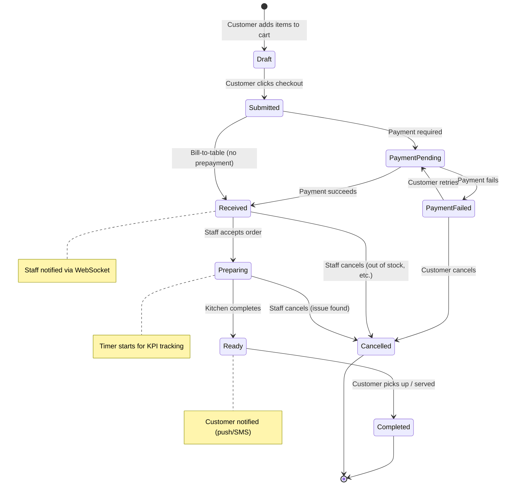

# Order State Machine

Order lifecycle and valid state transitions.

## State definitions
- **Draft:** Items in customer's cart; not yet submitted (ephemeral session).
- **Submitted:** Customer clicked checkout; awaiting payment or staff confirmation.
- **PaymentPending:** Waiting for payment gateway response.
- **PaymentFailed:** Payment declined; customer can retry or cancel.
- **Received:** Order confirmed, paid (or bill-to-table), awaiting staff action.
- **Preparing:** Staff accepted and is preparing the order.
- **Ready:** Order is ready for pickup or delivery.
- **Completed:** Order delivered/picked up; transaction closed.
- **Cancelled:** Order cancelled by customer or staff.

## Valid transitions (enforced in OrderService)
| From             | To               | Trigger                          | Permission       |
|------------------|------------------|----------------------------------|------------------|
| Draft            | Submitted        | Customer checkout                | Customer         |
| Submitted        | PaymentPending   | Payment initiated                | System           |
| PaymentPending   | PaymentFailed    | Payment gateway error            | System           |
| PaymentPending   | Received         | Payment success                  | System           |
| PaymentFailed    | PaymentPending   | Customer retries payment         | Customer         |
| PaymentFailed    | Cancelled        | Customer cancels                 | Customer         |
| Submitted        | Received         | Bill-to-table selected           | Customer         |
| Received         | Preparing        | Staff accepts                    | Staff            |
| Received         | Cancelled        | Staff cancels (out of stock)     | Staff            |
| Preparing        | Ready            | Kitchen marks ready              | Staff            |
| Preparing        | Cancelled        | Staff cancels (issue)            | Staff            |
| Ready            | Completed        | Staff marks delivered/picked up  | Staff            |

## Business rules
- Orders in `Draft` state are not persisted (stored in session/cache); timeout after 30 minutes.
- `Received` → `Preparing` transition starts the timer for time-to-serve KPI.
- `Ready` state triggers customer notification (push, SMS, or in-app banner).
- `Cancelled` orders are soft-deleted (marked inactive) for audit trail.
- Only staff can transition from `Received` onward (customers cannot modify after checkout).

## Notifications & side effects
- **Received:** Trigger WebSocket event to staff dashboard; increment pending order count.
- **Preparing:** Update KPI timer; log event for analytics.
- **Ready:** Send push notification to customer; optional SMS if phone provided.
- **Completed:** Close order; update tenant sales metrics.
- **Cancelled:** Refund payment if prepaid; log cancellation reason.

## Related docs
- User Story: FR-6-001 (06-USER_STORIES.md)
- SRS: FR-6 Order Processing (02-SRS.md)
- Acceptance Criteria: 07-ACCEPTANCE_CRITERIA.md
