# Customer Ordering Flow

This diagram shows the end-to-end customer ordering flow from QR scan to order confirmation.

```mermaid
sequenceDiagram
    actor Customer
    participant QR as QR Code
    participant Frontend as Customer Web App
    participant Backend as API Server
    participant DB as Database
    participant Staff as Staff Dashboard/KDS

    Customer->>QR: 1. Scan QR at table
    QR->>Frontend: 2. Open URL with signed token
    Frontend->>Backend: 3. Validate token & get tenant + table
    Backend->>DB: 4. Verify token, fetch tenant & menu
    DB-->>Backend: 5. Return menu items
    Backend-->>Frontend: 6. Return menu data
    Frontend->>Customer: 7. Display menu

    Customer->>Frontend: 8. Add items to cart
    Customer->>Frontend: 9. Customize items (modifiers)
    Customer->>Frontend: 10. Checkout

    Frontend->>Backend: 11. Create order (POST /orders)
    Backend->>DB: 12. Save order (status: Received)
    DB-->>Backend: 13. Order created
    Backend->>Staff: 14. Notify staff (WebSocket/poll)
    Backend-->>Frontend: 15. Return order confirmation

    Frontend->>Customer: 16. Show order confirmation + status

    Note over Customer,Staff: Real-time updates as staff processes order
    Staff->>Backend: 17. Update order status (Preparing → Ready)
    Backend->>DB: 18. Update order state
    Backend->>Frontend: 19. Push status update (WebSocket)
    Frontend->>Customer: 20. Show "Order Ready" notification
```

## Key decision points
- **Token validation (step 3):** Ensures QR is valid and not expired; maps to correct tenant/table.
- **Order creation (step 11):** Atomic transaction; includes cart items, modifiers, table context.
- **Staff notification (step 14):** Real-time push (WebSocket preferred) or polling fallback.
- **Status updates (step 19):** Bi-directional real-time updates for customer visibility.

## Related docs
- User Story: FR-4-001 (06-USER_STORIES.md)
- SRS: FR-5 Customer Ordering (02-SRS.md)
- Acceptance Criteria: 07-ACCEPTANCE_CRITERIA.md
