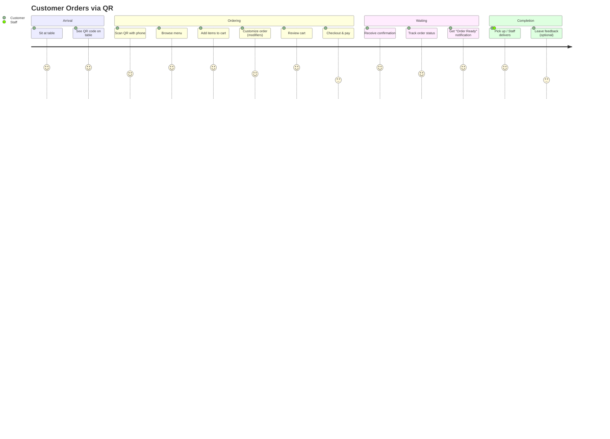
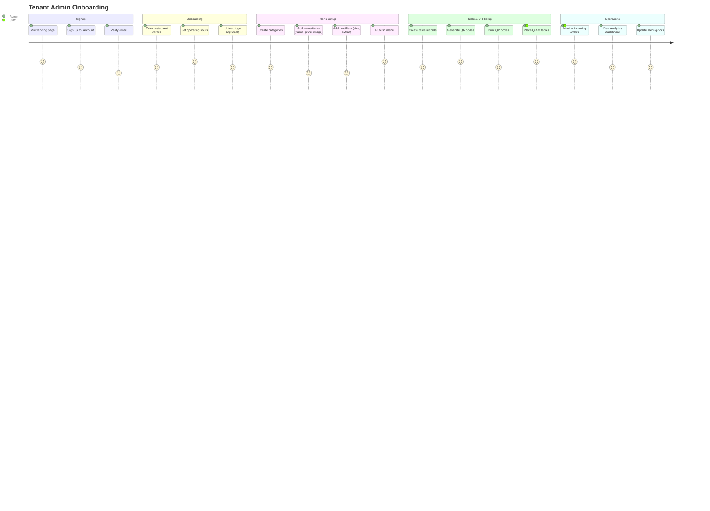
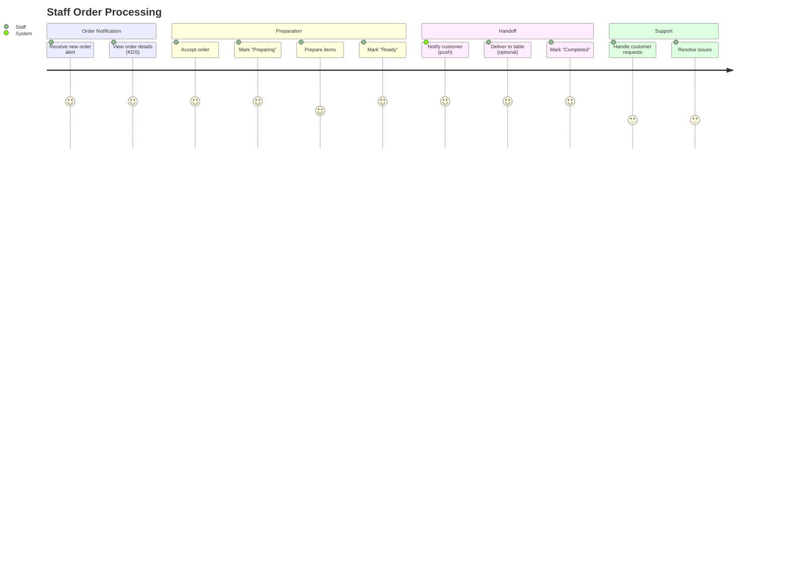

# User Journey Map

High-level journey for the three primary user types.

## Customer Journey (Diner ordering at table)

## Tenant Admin Journey (Restaurant owner setting up)

## Staff Journey (Kitchen/Server processing orders)

## Key touchpoints & pain points
- **Customer pain:** Long wait for staff to take order → **Solution:** QR self-ordering
- **Admin pain:** Complex POS systems → **Solution:** Simple web dashboard
- **Staff pain:** Missing/incorrect orders → **Solution:** Digital order list with clear item details

## Metrics to track per journey stage
- Customer: QR scan → order conversion (target: 10%)
- Admin: Signup → onboarding completion (target: 70% in 7 days)
- Staff: Order received → ready (target: median < 20 min)

## Related docs
- Personas: docs/09-ux/PERSONAS.md
- User Stories: 06-USER_STORIES.md
- Metrics: 08-METRICS_KPIS.md
